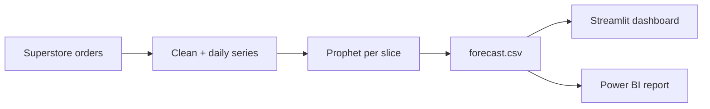

# Sales Forecasting Dashboard

A sales dashboard for the Sample Superstore dataset: KPI cards, region and
category drilldown, a year-over-year comparison, and a three-month sales
forecast with a confidence interval. The forecast is a Prophet model; the same
measures and forecast also back a Power BI report.

Live demo: https://sales-forecasting-dashboard-cqbjyxbpfnxu7kfzfj8emu.streamlit.app

I built this to practice a full forecasting workflow end to end: turning order
lines into a clean daily series, modelling it with Prophet (weekly and yearly
seasonality plus holiday effects), backtesting it honestly, and shipping the
result in a dashboard you can click around in.

## What it does

- Cleans the raw Superstore orders (9,994 order lines, 2015 to 2018) and sums
  them into a gap-free daily sales series.
- Fits a Prophet model with weekly and yearly seasonality and US public-holiday
  effects, each modelled separately, and forecasts three months ahead with a
  90% confidence interval.
- Trains one model per region and category slice offline and exports the whole
  forecast to `outputs/forecast.csv`, so the app never trains on startup.
- Serves it as a Streamlit dashboard: KPI cards, region and category filters
  that drive every tab, the forecast with its interval, and a year-over-year
  breakdown.



## The forecast

Prophet models the day-of-week pattern, the within-year shape and holiday
effects as separate components. Backtesting on a 90-day hold-out of the overall
series, the forecast of the period total lands within about 13% of actual,
which is the number a sales forecast is really judged on. The day-level error
is higher (WAPE around 70%) because daily sales are spiky - one large order can
swing a single day - so the app leads with the aggregate figure. There are more
notes in [docs/FORECASTING.md](docs/FORECASTING.md).

## Power BI

The resume version of this project is a Power BI report on the same data, with
KPI cards, region-to-category-to-sub-category drilldown, DAX measures for the
KPIs and the year-over-year comparison, and row-level security so a regional
manager only sees their own region. A Power BI report needs a paid license or
the Windows desktop app to open, so it cannot be hosted for free in a browser -
this Streamlit app is the openly clickable version and shows the same numbers.

The Power BI build lives in [powerbi/](powerbi/): the DAX measures in
[dax_measures.dax](powerbi/dax_measures.dax) and the model and report design in
[MODEL.md](powerbi/MODEL.md). The measures are the exact counterparts of the
functions in `forecasting/features.py`, and `scripts/push_to_powerbi.py` loads
the exported forecast into the Power BI dataset over the REST API so the report
never has to be refreshed by hand.

## Run it locally

```bash
git clone https://github.com/Kirill-Streltsov/sales-forecasting-dashboard.git
cd sales-forecasting-dashboard

python3.12 -m venv .venv && source .venv/bin/activate
pip install -r requirements.txt
pip install -e .

streamlit run app.py
```

Then open http://localhost:8501. The app runs on the forecast that ships in
`outputs/`, so it works straight away.

To retrain the forecast (this needs the dev dependencies, which include
Prophet):

```bash
pip install -r requirements-dev.txt
python scripts/prepare_data.py
python scripts/train_forecast.py
```

To load the forecast into a Power BI dataset, set the `PBI_*` environment
variables described in `scripts/push_to_powerbi.py` and run it.

## Tests

```bash
pip install -r requirements-dev.txt
pytest
```

The Power BI push client is tested with a fake HTTP session, so those tests run
without any credentials or network.

## Layout

```
app.py          Streamlit dashboard (overview, forecast, YoY, Power BI)
forecasting/    the pipeline: config, data, features, forecast, powerbi
scripts/        prepare data, train the forecast, push to Power BI
powerbi/        DAX measures and the report / model design
outputs/        the exported forecast the app reads
notebooks/      the analysis and forecasting notebook
tests/          unit tests
```
